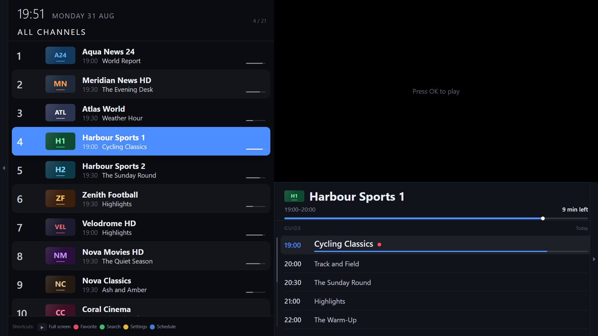
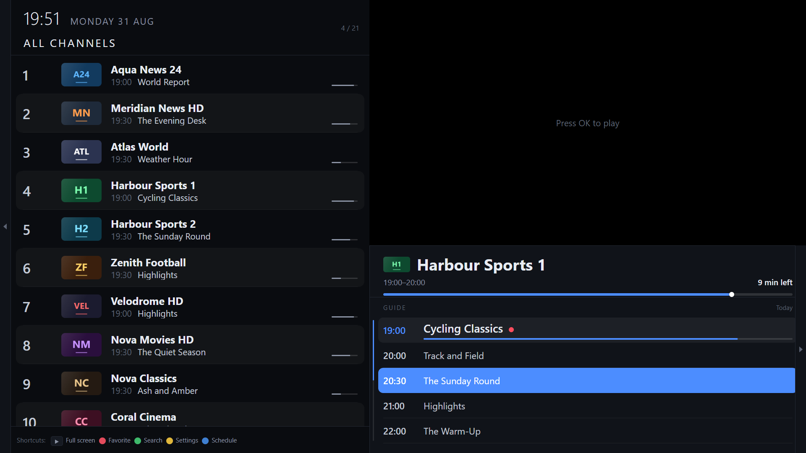
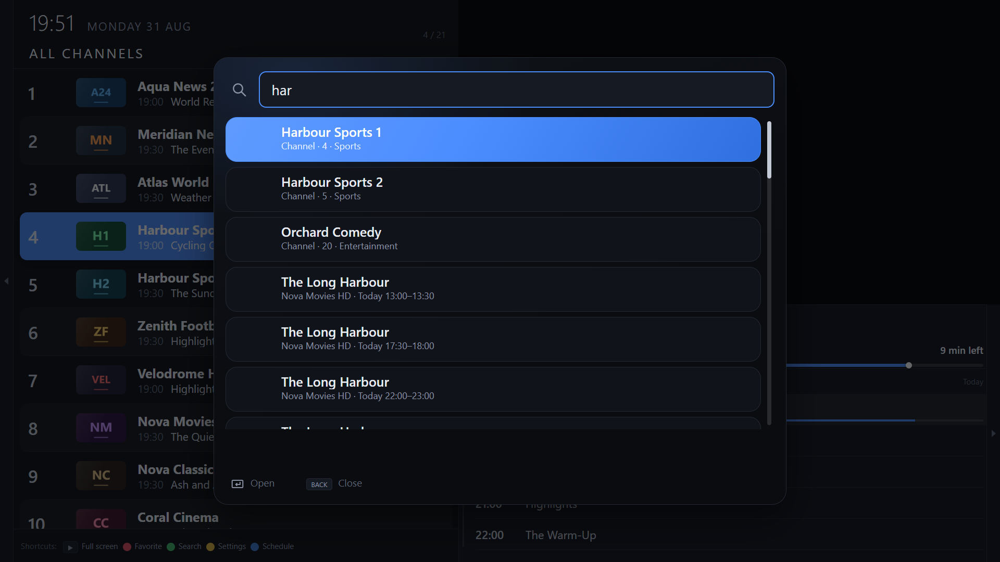
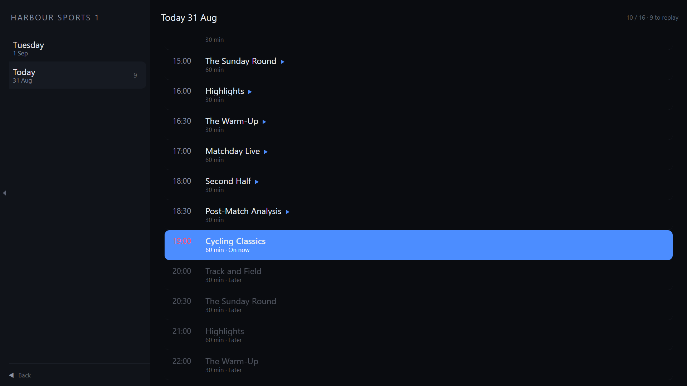
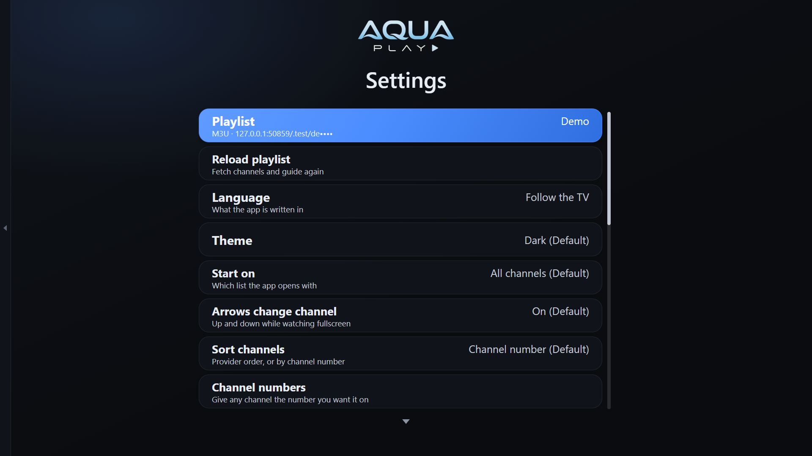
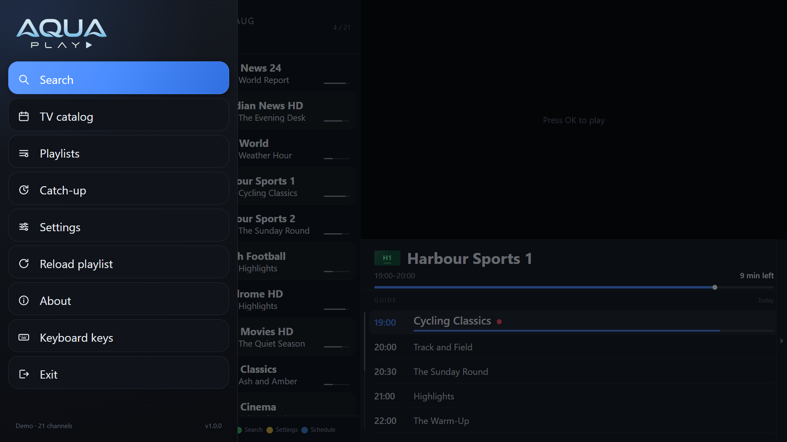
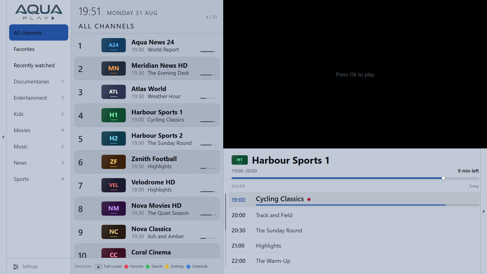

<div align="center">


# AquaPlay IPTV

**An IPTV player for Samsung Tizen TVs and Android TV.**
No framework, no build step, no telemetry, no account — the files that run on the television are the files in this repository.

[](https://github.com/Dolev24/aquaplay-iptv/releases)
[](LICENSE)
[-1428a0)](#put-it-on-a-samsung-tv)
[](#put-it-on-an-android-tv)
[](#testing)



</div>

---

## Why this exists

Most IPTV apps for a television are a phone app that has been made bigger. This one was written for a remote control with four arrows and an OK button, and for a 2018 Samsung set with a browser from 2017 in it.

That constraint shows up everywhere and is the point:

- **It is fast on slow hardware.** A 5,000-channel list lives in a pool of eighteen DOM rows that are rewritten in place, never rebuilt — scrolling two hundred rows touches the same eighteen elements. That number is asserted by the test suite, not hoped for.
- **It reads a gzipped XMLTV guide** on a set whose browser has no `DecompressionStream`, with an inflate written for the purpose. A 30 MB `.gz` inflates to 242 MB, and that string is never built: the decoder hands out slabs and a streaming scanner reads them as they arrive, pausing so the remote still answers. Measured — a 218 MB guide with 887,000 programmes is ready in 2.6 s, longest frozen stretch 193 ms.
- **Nothing is a font glyph.** Every icon is drawn from borders, masks and gradients, because a television falls back to whatever font it feels like and you get tofu boxes where the clock should be.
- **No accounts, no analytics, no ads, no phone-home.** Your playlist is stored on the television and goes to your provider and nowhere else. The only outbound request the app makes on its own is a once-a-day check for a newer release, and it fails silently.

---

## What it does

**Playlists**
Xtream Codes, or an M3U/M3U8 URL with an optional XMLTV guide. The guide URL is picked up automatically from `#EXTM3U url-tvg="…"`. Several playlists, switched from the menu.

**Live, Movies and Series**
One playlist yields all three. Series get a proper detail screen — seasons, episodes, plot — and up/down moves through episodes while one is playing. Films and episodes seek; a live channel winds back through catch-up instead.

**The guide**
A schedule panel beside the picture, a full catch-up browser a day at a time, reminders that fire while you are watching something else, and replay for any programme your provider still holds.

**Finding things**
Search covers channel names *and* programme titles across the whole guide. Channel numbers can be reassigned to whatever you want them to be. Favourites, recently watched, and a groups rail that stays out of the way.

**Living with it**
Ten languages. A light theme. Per-channel PIN locks. Picture-size control. Buffer tuning for a slow line. It reconnects a dropped stream on its own and tells you when a provider — rather than a channel — has gone down.

<div align="center">

| | |
|:--:|:--:|
| <br>**The schedule, beside the picture** | <br>**Search covers programmes too** |
| <br>**Catch-up, a day at a time** | <br>**Settings** |
| <br>**The menu, one press left** | <br>**A light theme, for a bright room** |

</div>

---

## Install

> **AquaPlay does not come with any channels.** It is a player. You bring a playlist from a provider you already pay for, or a public one you are entitled to use.

### Put it on a Samsung TV

Samsung will not install a package it has not signed, and there is no way around that from this end — a `.wgt` has to carry a certificate made against **your** television's DUID.

1. Build the package: `cd app && npm run pack` → `AquaPlay-1.0.0.wgt`
2. In Tizen Studio, open **Tools → Certificate Manager** and create a Samsung certificate profile. It asks for a Samsung account and your TV's Device Unique ID.
3. On the TV: **Apps**, then `12345` on the remote, to turn on Developer Mode and enter your computer's IP.
4. Sign and install with Tizen Studio's Device Manager, or `tizen install -n AquaPlay-1.0.0.wgt -t <device>`.

Full walkthrough: [`app/README.md`](app/README.md#put-it-on-the-tv).

### Put it on an Android TV

`adb install AquaPlay-1.0.0.apk`, or copy it across with a file manager and open it. Android TV 5.0 and up, leanback launcher, and it plays through ExoPlayer rather than a WebView.

### Try it in a browser first

```bash
node app/tools/dev-server.js 8081
```

Open the address it prints. The whole app runs unchanged in Chrome, keys and all — press `H` for the keyboard map. The dev server also proxies provider requests around CORS, gunzips guides, and answers range requests so a film can be sought.

---

## Build it

```bash
cd app
npm install          # playwright-core, for the tests. The app has no dependencies.
npm run pack         # -> AquaPlay-<version>.wgt for Tizen
npm run icons        # regenerate every icon from tools/icon-source.jpg
```

```bash
cd android
./gradlew assembleRelease    # -> app/build/outputs/apk/release/
```

The Android build reads its version out of `app/config.xml`, so there is one version number for both platforms. Signing is optional and local — see [`android/keystore.properties.example`](android/keystore.properties.example).

### Testing

```bash
cd app && npm test
```

**1,062 tests in five suites.** The parsers, store and guide run against the real modules in a fake `window`; the dev proxy runs against a mock upstream; three browser suites drive real key events through `playwright-core` against the Chrome already on your machine, one of them against a fake AVPlay that enforces Tizen's state machine. No browser download, no provider account, no network.

---

## How it is built

```
app/
  index.html          one page, every screen
  js/                 the app — no framework, no bundler, no transpiler
    views/            channels, settings, catalogue, replay, series, setup, numbers
    epg.js            streaming XMLTV scanner + a pure-JS inflate
    player.js         AVPlay on Tizen, ExoPlayer on Android, <video> in a browser
  tools/              dev server, packer, icon generator, five test suites
android/              a WebView, a decoder and a key map — about 1,200 lines of Kotlin
```

[`ARCHITECTURE.md`](ARCHITECTURE.md) is the long version: why the awkward parts are awkward, and what each of them cost. The gzip decoder that lets a 2018 set read a `.gz` guide. The AVPlay display-rect race. The transparent page that has to stay transparent or it covers the video. Why a missing IDR frame looks exactly like a broken decoder. It is written for whoever picks this up next, including me.

---

## Contributing

Issues and pull requests are welcome. If you are reporting a playback problem, the useful things are: the set (model and year), whether the provider is Xtream or M3U, and what the app said rather than what it did.

## Licence

MIT — see [LICENSE](LICENSE).

`app/lib/hls.min.js` is [hls.js](https://github.com/video-dev/hls.js), Apache-2.0, which keeps its own terms. It is used only for playback in a desktop browser and is deliberately left out of the TV package; Tizen plays through AVPlay and Android through ExoPlayer.

<div align="center">
<sub>AquaPlay is a player. It ships with no channels, no playlists and no links to any.</sub>
</div>
